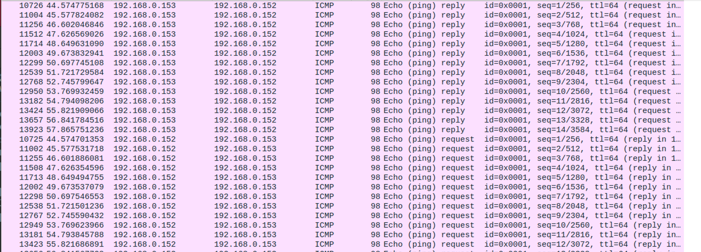
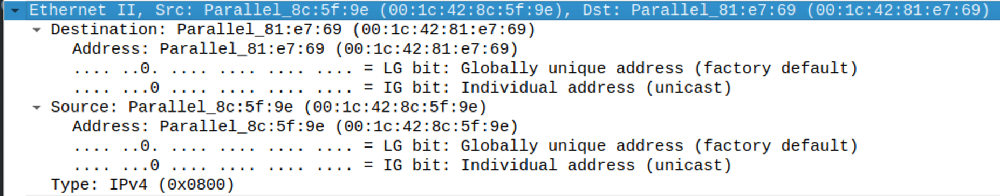
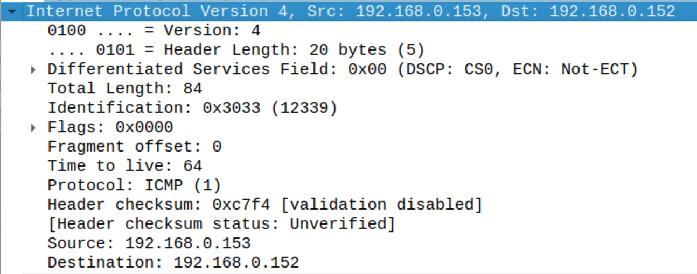
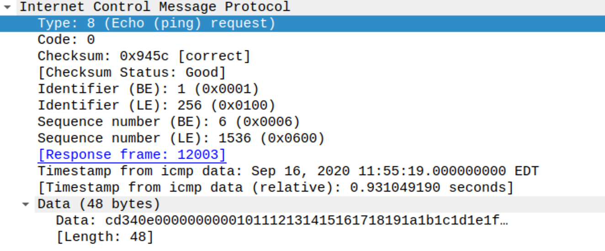

# Lab 2

## Part 2
Ping VM2 from VM1 and capture packets using Wireshark

**Ethernet Src:** Parallel_8c:5f:9e (00:1c:42:8c:5f:9e)
**Ethernet Dst:** Parallel_81:e7:69 (00:1c:42:81:e7:69)
**Ethernet Type:** IPv4 (0x0800)

**IP Src:** 192.168.0.153
**IP Dst:** 192.168.0.152
**IP Protocol:** ICMP (1)

**ICMP Reply Type:** Type: 0 (Echo (ping) reply)
**ICMP Request Type:** Type: 8 (Echo (ping) request)

